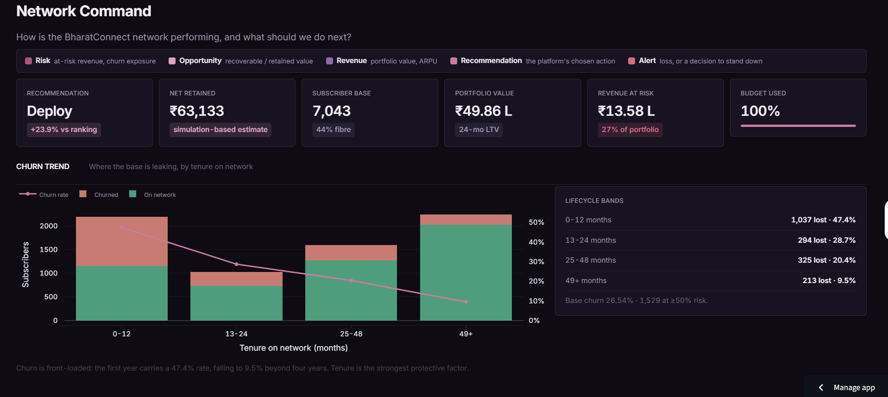
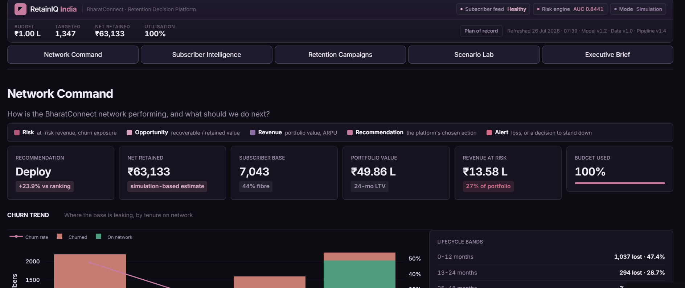
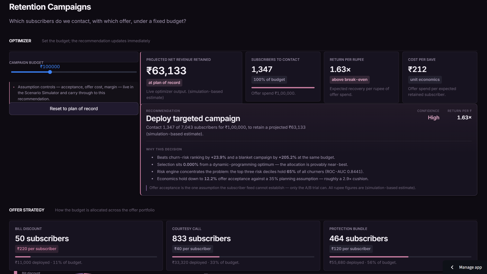
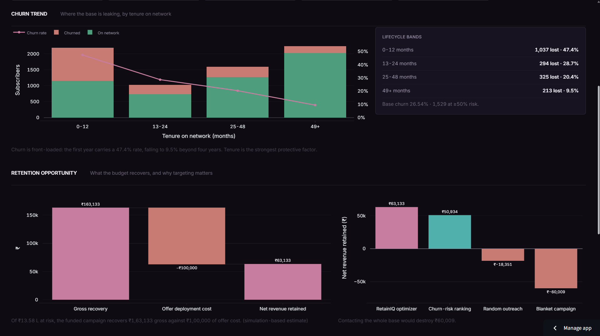
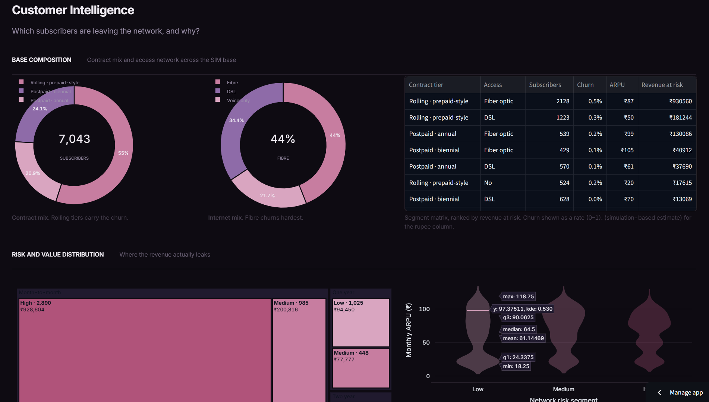
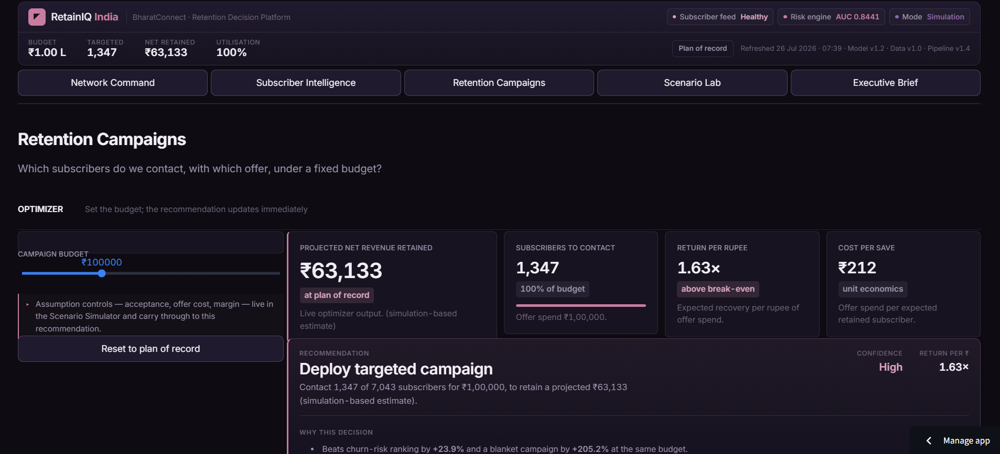
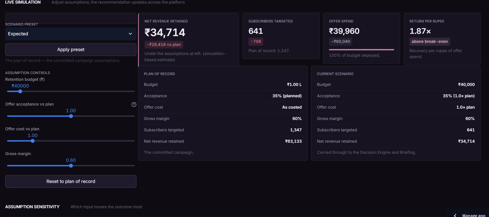
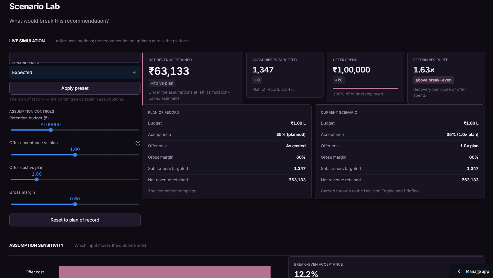
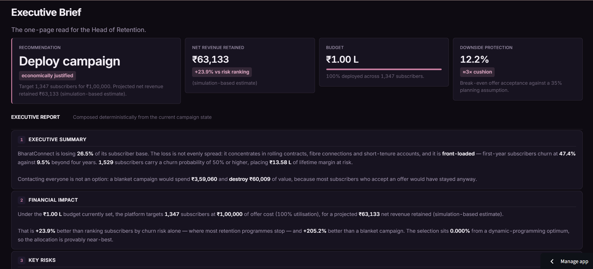

<div align="center">



# RetainIQ India

### A telecom retention **decision intelligence** platform — not another churn model

*"I don't predict who churns. I decide who to contact, with which offer, under a fixed budget, to maximise net revenue retained."*

<br/>

[](https://retainiq-india.streamlit.app/)
[](https://github.com/garima-nandal17/RetainIQ_India/actions)
[](https://github.com/garima-nandal17/RetainIQ_India/tree/main/tests)


git stt
**[ Live Demo](https://retainiq-india.streamlit.app/)** · **[ Source](https://github.com/garima-nandal17/RetainIQ_India)** · **[ Author](https://www.linkedin.com/in/garima-nandal-707590272)**

</div>

<br/>

<div align="center">



*Five decision modules, one persistent campaign state — a guided workflow, not a scrolling report.*

</div>

---

## The one-minute version

A telecom retention team has a **fixed monthly budget** and a subscriber base that is **26.5% likely to churn**. They cannot contact everyone — a blanket campaign *destroys* value, because most people who accept a retention offer were never going to leave. They cannot simply call the highest-risk subscribers either, because **risk is not value**.

So the question that matters is not *"who will churn?"* It is:

> **Which subscribers do we contact, with which offer, under a fixed budget, to keep the most revenue?**

**RetainIQ India** answers that. Given a ₹1,00,000 budget across 7,043 subscribers, it recommends contacting **1,349 of them** for a projected **₹63,133 net revenue retained** `(simulation-based estimate)` — **+23.9%** better than ranking by churn risk, and **+205%** better than contacting everyone (which loses ₹60,009). The selection is **provably within 0.000%** of a mathematically optimal allocation.

Every number is reproducible from raw data with one command, verified by 71 tests, and gated by CI.

---

## Results at a glance

<div align="center">

| Metric | Value | Meaning |
|:---|:---:|:---|
| **Net revenue retained** | **₹63,133** | under a ₹1,00,000 budget `(simulation-based)` |
| **Uplift vs risk ranking** | **+23.9%** | over the approach most churn projects stop at |
| **Uplift vs contact-everyone** | **+205%** | a blanket campaign *loses* ₹60,009 |
| **Subscribers targeted** | **1,349 / 7,043** | at 100% budget utilisation |
| **Optimality gap** | **0.000%** | vs a dynamic-programming optimum |
| **Break-even acceptance** | **12.2%** | vs 35% planned — a ~3× safety cushion |
| **Churn engine ROC-AUC** | **0.8441** | Brier score 0.1367 (well-calibrated) |
| **Churners in top 30% risk** | **65%** | the engine concentrates the problem |

</div>

---

## The insight that makes it work

**No single risk threshold can ever be optimal.**

Whether a subscriber is worth contacting depends on their **lifetime value**, not their churn probability alone. Across this base, the break-even churn probability ranges from **0.22 to 1.96** — so any fixed cut-off is wrong for most of the population.

That reframes retention targeting from a **classification** problem into an **allocation** problem. RetainIQ solves it as a **0/1 knapsack** — choose the set of (subscriber, offer) pairs that maximises net revenue retained subject to the budget constraint — and verifies the greedy solution against a dynamic-programming bound.

<div align="center">


*The Decision Engine doesn't just recommend — it states its confidence, its return per rupee, and the evidence behind the call.*
</div>

---

## The platform

Five modules, each answering one business question, connected by a **persistent campaign state** — a budget or assumption set on any page propagates to all of them, so the tool behaves like software an operator uses, not a set of disconnected charts.

###  Network Command
*"How is the network performing, and what should we do next?"*

The executive overview: revenue at risk, subscriber health, churn by tenure, and the recommended action. A persistent command bar carries the global KPIs; the colour legend lives here, where users land.

<div align="center"></div>

Churn is **front-loaded** — first-year subscribers churn at **47.4%** against **9.5%** beyond four years — so tenure is the single strongest protective factor, measured directly rather than assumed.

###  Subscriber Intelligence
*"Which subscribers are leaving, and why?"*

Segmentation, revenue leakage by contract tier and risk band, SHAP-explained churn drivers, and subscriber archetypes built from the real base. High-risk subscribers pay **more**, not less — so retention here defends premium revenue.

<div align="center"></div>

###  Retention Campaigns — *the flagship*
*"Whom do we contact, with which offer, under budget?"*

A **live budget optimizer**, offer-strategy allocation, and a **priority queue ranked by return per rupee** — filterable by offer, risk band, and value tier, and exportable as the campaign contact list.

<div align="center"></div>

Move the budget and the entire recommendation re-solves in real time:

<div align="center"></div>

###  Scenario Lab
*"What would break this recommendation?"*

Live assumption controls — budget, offer acceptance, offer cost, gross margin — plus five presets (Conservative · Expected · Aggressive · Worst case · Best case), a tornado chart, and a two-way sensitivity heatmap. Under pessimistic assumptions the platform **recommends holding the budget** rather than spending it.

<div align="center"></div>

###  Executive Brief
*"Give me the one-page read."*

A board-ready report in six sections — Executive Summary, Financial Impact, Key Risks, Recommendation, Approval Required, Expected Outcome — composed **deterministically** from the live campaign state. No language model is involved, and the app says so: every figure is traceable to a governed metric.

<div align="center"></div>

---

## Architecture

Everything upstream of the optimizer exists to make its decision **trustworthy**; everything downstream exists to **stress-test and communicate** it.

```
                          RAW SUBSCRIBER DATA  (public IBM Telco, relabelled)
                                    │
                    ┌───────────────┴───────────────┐
                    ▼                                ▼
         SQL schema + load                  5-dimension data-quality
            (DuckDB)                    (freshness · completeness · uniqueness
                    │                     · consistency · accuracy)
                    ▼
       advanced-SQL feature layer  ──►  Kaplan-Meier survival · cohorts · adoption
      (window functions, indexing)                    │
                    │                                  ▼
                    ▼                          hypothesis testing
          calibrated churn engine  ◄───  (which drivers are real)
        (logistic + tree challenger)
                    │
                    ▼
            SHAP explainability
                    │
                    ▼
        per-subscriber LTV  ──►  rupee profit curve
                    │
                    ▼
    ★ BUDGET-CONSTRAINED OPTIMIZER ★   ◄── the thesis: 0/1 knapsack, DP-verified
                    │
        ┌───────────┼───────────┐
        ▼           ▼           ▼
   sensitivity   scenario     A/B experiment
   analysis      simulation   design
        └───────────┼───────────┘
                    ▼
    5-PAGE STREAMLIT DECISION PLATFORM  →  executive memo  →  reproducible repo + CI
```

**The 9-stage pipeline** (`src/run_pipeline.py`), each stage a standalone, tested module:

`load_data` → `build_features` → `data_quality` → `model` → `ltv` → `profit_curve` → **`optimizer`** → `sensitivity` → `simulator`

---

## Tech stack & why

| Layer | Choice | Why this, not the obvious alternative |
|:---|:---|:---|
| **Feature engineering** | SQL / DuckDB (CTEs, window functions) | SQL-first with documented indexing and `EXPLAIN` tuning — warehouse-scale signal, not pandas-only |
| **Data quality** | Custom 5-dimension framework | freshness · completeness · uniqueness · consistency · accuracy, each pass/fail — mirrors real analytics-engineering (dbt-test) practice |
| **Survival** | Kaplan-Meier (lifelines) | retention *timing*, which changes intervention urgency — rarely seen in churn portfolios |
| **Model** | Calibrated logistic regression + tree challenger | interpretability beats a 0.002 AUC gain when a human is about to spend money on the output |
| **Explainability** | SHAP + coefficient reading | a stakeholder-facing driver narrative, not just feature importances |
| **Decision** | 0/1 knapsack, greedy-by-ROI, DP-verified | the core contribution — turning probabilities into a budget-constrained action |
| **App** | Streamlit (5 pages, persistent state, fragments) | a clickable decision tool, not a static notebook |
| **Reproducibility** | Makefile · pytest (71) · GitHub Actions | one command rebuilds everything; CI rebuilds from source and fails on drift |

---

## Run it locally

```bash
# clone
git clone https://github.com/garima-nandal17/RetainIQ_India.git
cd RetainIQ_India

# one-command workflows (Makefile)
make setup      # install pinned dependencies
make pipeline   # rebuild every analytic from raw data
make app        # launch the platform
make verify     # audit + 71 tests + assert the frozen headline numbers
```

`make all` runs `setup → pipeline → verify` end to end. Requires Python 3.13.

> **Contributor note:** page modules live in `app/views/`. Do **not** rename that folder to `app/pages/` — Streamlit reserves the name `pages/` for its own automatic navigation, which collides with this app's explicit router.

---

## Reproducibility & engineering rigour

This is the part that separates a portfolio piece from a notebook.

- ** One command rebuilds everything.** `src/run_pipeline.py` runs the 9-stage chain from the raw CSV. *Verified by deleting all outputs and regenerating them — the headline figures returned to the rupee.*
- ** Static integrity auditor.** `tools/audit_app.py` walks the AST and resolves every module, every cross-module reference, and every page's `render()`. The "referenced but never generated" defect class cannot reach a green build.
- ** Frozen-metric guard.** `tools/check_frozen.py` fails loudly if any headline number drifts. The numbers are a committed contract.
- ** CI on every push.** GitHub Actions installs pinned dependencies on a clean runner, **rebuilds the pipeline from source**, audits, runs 71 tests, and asserts the frozen figures. Reproducibility is *proven*, not claimed.

Model trained on **5,634** subscribers, evaluated on a held-out **1,409** — leakage-free split, probability-calibrated.

---

## Project structure

```
RetainIQ_India/
├── app/
│   ├── dashboard.py            # entry point — top-tab router + command bar
│   ├── views/                  # 5 page modules + shared shell
│   └── components/             # theme · ui · charts · data · state
├── src/                        # 17 pipeline modules + run_pipeline.py
│   ├── load_data · build_features · data_quality
│   ├── model · ltv · profit_curve
│   ├── optimizer ★ · decision_engine · economics
│   └── sensitivity · simulator · survival · cohorts · adoption · …
├── sql/                        # schema · feature layer · performance notes
├── tests/                      # 71 tests across 8 files
├── tools/                      # audit_app.py · check_frozen.py
├── notebooks/                  # 01_eda … 05_profit
├── docs/                       # BRD · executive memo · A/B design · STAR · screenshots
├── reports/                    # governed metrics the app reads (committed)
├── data/                       # raw (public) + processed (DuckDB, parquet)
├── Makefile · requirements.txt · runtime.txt · .github/workflows/ci.yml
└── RUNLOG.md                   # full engineering decision log (every ADR)
```

---

## Design system

A **single tonal family** — a plum-rose palette where every accent carries exactly one business meaning, separated by lightness and warmth rather than unrelated hues. Colour is information, never decoration.

| Colour | Meaning |
|:---|:---|
|  Deep rose `#B0537A` | **Risk** — at-risk revenue, churn exposure |
|  Light mauve `#D9A5C0` | **Opportunity** — recoverable, retained value |
|  Plum-violet `#8E6BA8` | **Revenue** — portfolio value, ARPU |
|  Brand rose `#C77DA0` | **Recommendation** — the platform's chosen action |
|  Coral-rose `#D96B84` | **Alert** — loss, or a decision to stand down |

---

## Deliberately *not* built

Documenting what you chose **not** to build is as important as what you shipped. Each was considered and declined as a tradeoff against the thesis.

| Not built | Why not |
|:---|:---|
| **Deep learning** | A retention head must trust *why* a subscriber is flagged before spending. The challenger bought 0.002 AUC and cost all interpretability. |
| **LLM / "AI" layer** | Adds interface novelty, not decision quality — it would not change whom we contact under budget. The Executive Brief is generated deterministically and says so. |
| **Real-time streaming** | Campaigns run monthly. Streaming buys complexity with zero decision benefit at this cadence. |
| **Growth / acquisition funnel** | This system optimises *retained* revenue. A signup funnel answers a different question. |
| **Uplift modelling** | The honest next step — targeting *persuadables*. Deferred because it needs the experiment data this project is designed to generate first. |
| **A second dataset** | Scope discipline. One base fully exploited beats two half-used. |

> *"I optimised a decision, not a metric — so I cut everything that improved the model's novelty but not the business decision."*

---

## Honesty pattern

Every rupee figure is labelled `(simulation-based estimate)` — in the app, the memo, and here.

**Measured** (from the subscriber base): churn rate, ARPU, tenure, fibre mix, model quality.
**Declared** (assumptions, centralised in `src/economics.py`): offer cost, acceptance rate, gross margin, budget.

The source data carries no prepaid flag, so postpaid/prepaid tiers are surfaced as a **declared mapping**, never a fabricated column. Offer acceptance is the one assumption the data cannot establish — which is exactly why the A/B design exists, and why uplift modelling is deferred until that trial runs. The platform will also **recommend spending nothing** when no subscriber has positive expected value — a system that knows when to stand down is more trustworthy than one that always finds a reason to deploy budget.

---

## Documentation

| Document | Contents |
|:---|:---|
| [`docs/BRD.md`](docs/BRD.md) | Business requirements — the framing, before any modelling |
| [`docs/executive_memo.md`](docs/executive_memo.md) | One-page decision memo for the Head of Retention |
| [`docs/AB_experiment_design.md`](docs/AB_experiment_design.md) | Power, guardrails, decision rule |
| [`docs/data_quality_framework.md`](docs/data_quality_framework.md) | The 5-dimension DQ framework |
| [`docs/product_metrics.md`](docs/product_metrics.md) | North Star + retention KPI tree |
| [`RUNLOG.md`](RUNLOG.md) | Full engineering decision log — every ADR, including the mistakes |
| [`docs/portfolio/STAR.md`](docs/portfolio/STAR.md) | Four interview-ready STAR stories |

---

<div align="center">

### Built by **Garima Nandal**

Economics → Business Analytics · Data · Decision Science

[](https://www.linkedin.com/in/garima-nandal-707590272)
[](https://github.com/garima-nandal17)
[](https://retainiq-india.streamlit.app/)

<sub>Data: the public IBM Telco churn dataset, relabelled as the fictional operator *BharatConnect*.
All rupee figures are simulation-based estimates derived from declared assumptions. Released under the MIT License.</sub>

</div>