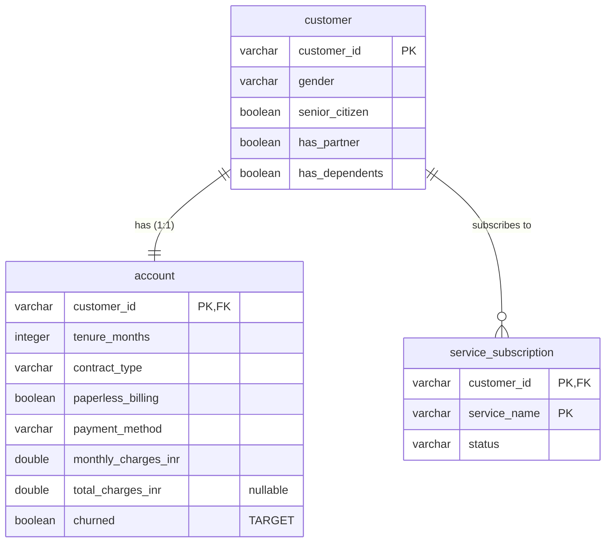

# Data Dictionary — RetainIQ India (BharatConnect)

Documents the normalized schema loaded by `src/load_data.py` into
`data/processed/retainiq.duckdb` (schema: `sql/schema.sql`). Source: the IBM
Telco Customer Churn dataset, relabeled as BharatConnect
(see `docs/data_acquisition.md`).

**Grain:** one customer per `customer`/`account` row; one (customer, service)
per `service_subscription` row.
**Volumes (verified at load):** 7,043 customers · 7,043 accounts · 63,387
service rows (7,043 × 9) · base churn rate **26.54%**.

## Entity-relationship diagram

---

## Table: `customer` — CRM master (who the customer is)
One row per customer. Stable identity and demographics.

| Column | Type | Source column | Transform | Notes |
|---|---|---|---|---|
| `customer_id` | VARCHAR (PK) | `customerID` | none | e.g. `7590-VHVEG`; unique, no nulls |
| `gender` | VARCHAR | `gender` | none | `Female` \| `Male` |
| `senior_citizen` | BOOLEAN | `SeniorCitizen` | `0/1 → false/true` | |
| `has_partner` | BOOLEAN | `Partner` | `Yes/No → true/false` | |
| `has_dependents` | BOOLEAN | `Dependents` | `Yes/No → true/false` | |

## Table: `account` — billing/commercial relationship + target
One row per customer (1:1 with `customer`). Holds the churn **target**.

| Column | Type | Source column | Transform | Notes |
|---|---|---|---|---|
| `customer_id` | VARCHAR (PK, FK→customer) | `customerID` | none | |
| `tenure_months` | INTEGER | `tenure` | cast int | range 0–72 |
| `contract_type` | VARCHAR | `Contract` | none | `Month-to-month` \| `One year` \| `Two year` |
| `paperless_billing` | BOOLEAN | `PaperlessBilling` | `Yes/No → bool` | |
| `payment_method` | VARCHAR | `PaymentMethod` | none | 4 values incl. `Electronic check` (elevated-risk signal) |
| `monthly_charges_inr` | DOUBLE | `MonthlyCharges` | denominated ₹ | ARPU; see currency note |
| `total_charges_inr` | DOUBLE (nullable) | `TotalCharges` | `strip → numeric → NULL` | **NULL for 11 tenure-0 customers** (blank in source) |
| `churned` | BOOLEAN | `Churn` | `Yes/No → bool` | **TARGET**; 26.54% positive |

## Table: `service_subscription` — provisioning (what they use)
Long/narrow: one row per (customer, service). Replaces 9 wide source columns.

| Column | Type | Source | Notes |
|---|---|---|---|
| `customer_id` | VARCHAR (PK part, FK→customer) | `customerID` | |
| `service_name` | VARCHAR (PK part) | column name | one of the 9 services below |
| `status` | VARCHAR | cell value | `Yes` \| `No` \| `No phone service` \| `No internet service` |

**The 9 `service_name` values:** `PhoneService`, `MultipleLines`,
`InternetService`, `OnlineSecurity`, `OnlineBackup`, `DeviceProtection`,
`TechSupport`, `StreamingTV`, `StreamingMovies`.

> **Why the 3-state `status` is preserved, not collapsed to boolean:**
> `No internet service` / `No phone service` encodes a *dependency* — you cannot
> hold OnlineSecurity without InternetService. Collapsing it to `No` would
> destroy that structure, which matters for adoption depth (Day 5).

---

## Design notes / decisions
- **Normalization vs denormalization.** This schema is the normalized *source
  of truth*. Day 3 builds a **denormalized feature view** on top for modeling.
  Rule: normalize to store (integrity, no repeating groups), denormalize to
  analyze (a wide feature matrix).
- **Three tables, not one**, to mirror real telecom systems: CRM (`customer`),
  billing (`account`), provisioning (`service_subscription`).
- **Currency (D-006).** Values are denominated in ₹ by *declaration*
  (BharatConnect is Indian); no FX multiplier is applied — that would add a
  spurious assumption for zero analytical gain.
- **`total_charges_inr` NULLs** are kept honest (not imputed to 0 or dropped);
  the Day-4 data-quality framework decides handling.